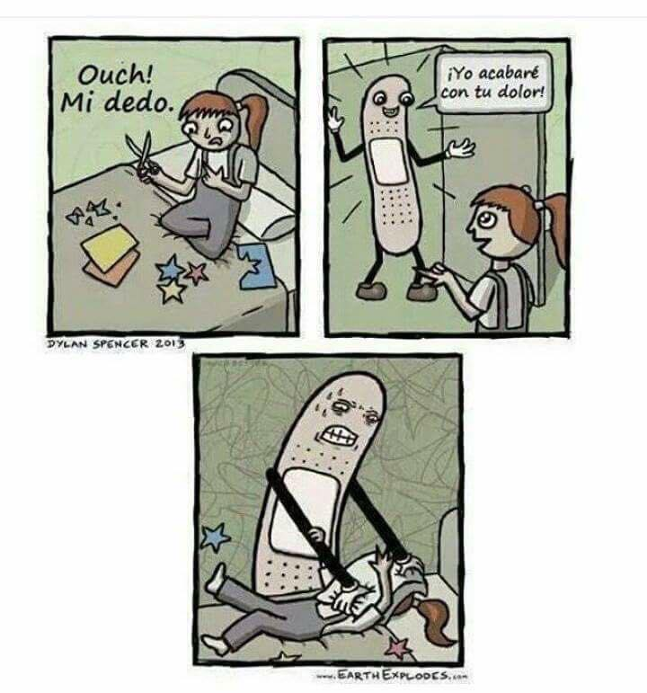

```{r setup, include=FALSE}
knitr::opts_chunk$set(echo = TRUE,
                      eval = TRUE,
                      fig.align = "right")
```

# Encabezados con Rmarkdown

Un encabezado tipo 1 (titulo principal) se denota con #  
Un encabezado tipo 2 (subtitulo) se denota con ##  
Un encabezado tipo 3 (subtitulo del tipo 2) se denota con ###  

## Subtitulo

### Encabezado tipo 3

# Viñetas

  - Viñeta 1
    - Subviñeta 1
        - Subviñeta 1.1
  + Viñeta 2  
       + Subviñeta 2  
             + Subviñeta 2.1
  * Viñeta 3
     * Subviñeta 3  
         *Subviñeta 3.1
         
# Insertando imagen
<center>

</center>

#Insertar hipervínculo

https://unal-semilleror-facca.github.io/Actividades/1_Intro.html#/configuracion-de-git

[Aqui](https://unal-semilleror-facca.github.io/Actividades/1_Intro.html#/configuracion-de-git)


# Opciones de texto

*Esto es cursiva*  
_Esto también es cursiva_  
**Esto es negrilla**  
__Esto también es negrilla__  
***Esto es cursiva negrilla***  
___Esto es cursiva negrilla___  

# Plot con R

```{r}
plot(iris)
```

```{r, fig.align= "center"}
plot(mtcars)
```


    
